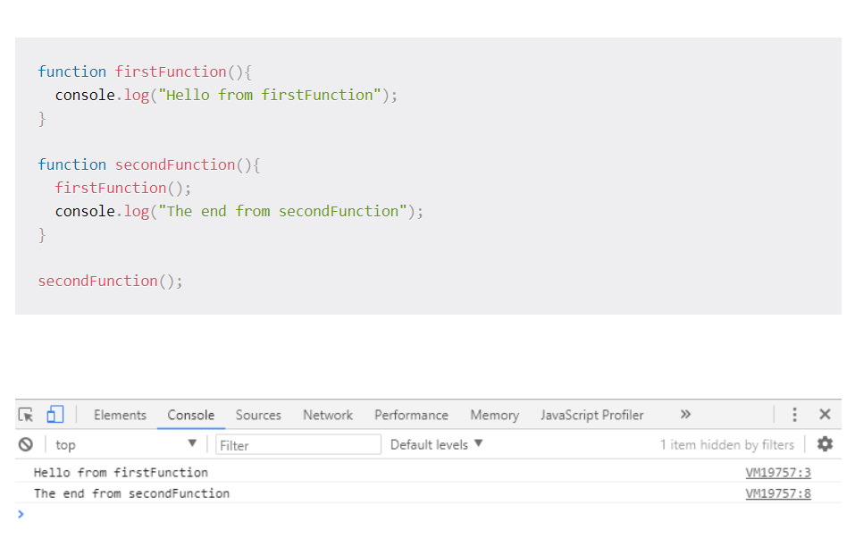

# Understanding the JavaScript Call Stack
1. **What is a ‘call’?**
**Manage function invocation**: The call stack maintains a record of the position of each stack frame. It knows the next function to be executed (and will remove it after execution). This is what makes code execution in JavaScript synchronous.
.
2. **How many ‘calls’ can happen at once?** 
Since the call stack is single, function(s) execution, is done, one at a time, from top to bottom. It means the call stack is synchronous.
.
3. **What does LIFO mean?**
**LIFO**:  Last In, First Out(LIFO) principle which used to temporarily store and manage function invocation (call). It means that the last function that gets pushed into the stack is the first to be pop out, when the function returns.
.
4. **Draw an example of a call stack and the functions that would need to be invoked to generate that call stack.**

5. **What causes a Stack Overflow?**
A stack overflow occurs when there is a recursive function (a function that calls itself) without an exit point. The browser (hosting environment) has a maximum stack call that it can accomodate before throwing a stack error.

Here is an example:
**function callMyself(){**
  **callMyself();**
}

**callMyself();**
.
# JavaScript error messages
1. **What is a ‘refrence error’?**
This is as simple as when you try to use a variable that is not yet declared you get this type os errors.
**console.log(foo) // Uncaught ReferenceError: foo is not defined**
.
2. **What is a ‘syntax error’?**
This occurs when you have something that cannot be parsed in terms of syntax, like when you try to parse an invalid object using JSON.parse.
**JSON.parse( {'foo': 'bar'} ) // Uncaught SyntaxError: Unexpected token o in JSON at position 1**
.
3. **What is a ‘range error’?**
Try to manipulate an object with some kind of length and give it an invalid length and this kind of errors will show up.
**var foo= []
foo.length = foo.length -1 // Uncaught RangeError: Invalid array length**
.
4. **What is a ‘tyep error’?**
Like the name indicates, this types of errors show up when the types (number, string and so on) you are trying to use or access are incompatible, like accessing a property in an undefined type of variable.
**var foo = {}
foo.bar // undefined
foo.bar.baz // Uncaught TypeError: Cannot read property 'baz' of undefined**
.
5. **What is a breakpoint?**
a line in our code that we need to debug. If the line we selected was run we will be able to see what has happened before that point and we can try and evaluate the next lines to check if everything is outputting what we are expecting.
.
6. **What does the word ‘debugger’ do in your code?**
I creates a **breakpoint** by putting a debugger statement in the code in the line you want to break.

## Things I want to know more about