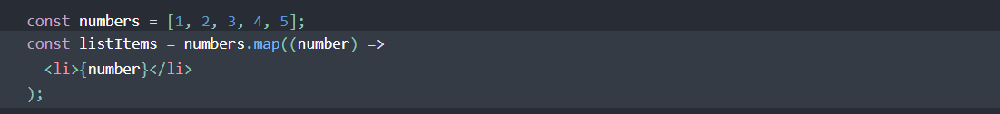
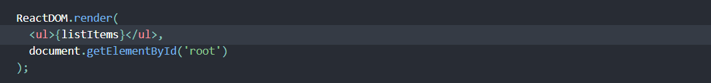
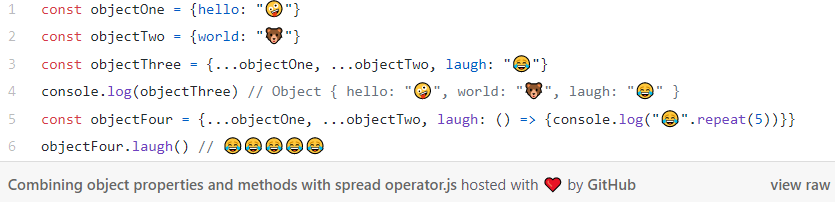

# React Docs - lists and keys
1. **What does .map() return?**
It returns a new array with same length as the original one.

2. **If I want to loop through an array and display each value in JSX, how do I do that in React?**
Here, we would use curly braces {}. we loop through the original array using the JavaScript **map()** function. We return a (li>) element for each item. Finally, we assign the resulting array of elements to listItems. Then We include the entire listItems array inside a <ul> element, and render it to the DOM.

3. **Each list item needs a unique ____.**
A **“key”** is a special string attribute you need to include when creating lists of elements. 

4. **What is the purpose of a key?**
Keys help React identify which items have changed, are added, or are removed. Keys should be given to the elements inside the array to give the elements a stable identity. The best way to pick a key is to use a string that uniquely identifies a list item among its siblings. Most often you would use IDs from your data as keys.

# The Spread Operator
1. **What is the spread operator?**
The spread operator **(...)** is a useful and quick syntax for adding items to arrays, combining arrays or objects, and spreading an array out into a function’s arguments. In JavaScript, spread syntax refers to the use of an ellipsis of three dots (…) to expand an iterable object into the list of arguments.

2. **List 4 things that the spread operator can do.**
+ Copying an array
+ Concatenating or combining arrays
+ Adding an item to a list
+ Adding to state in React

3. **Give an example of using the spread operator to combine two arrays.**

4. **Give an example of using the spread operator to add a new item to an array.**

5. **Give an example of using the spread operator to combine two objects into one.**

# How to Pass Functions Between Components
1. **In the video, what is the first step that the developer does to pass functions between components?**
creating the function wherever we want the state to  change.
.
2. **In your own words, what does the increment function do?**
Used to loop through an array and find the matching name to update it.
.
3. **How can you pass a method from a parent component into a child component?**
We pass a method from a parent component into a child component by using **props**.
.
4. **How does the child component invoke a method that was passed to it from a parent component?**
By using **state**, when clicked on the button, it will invoke that method.