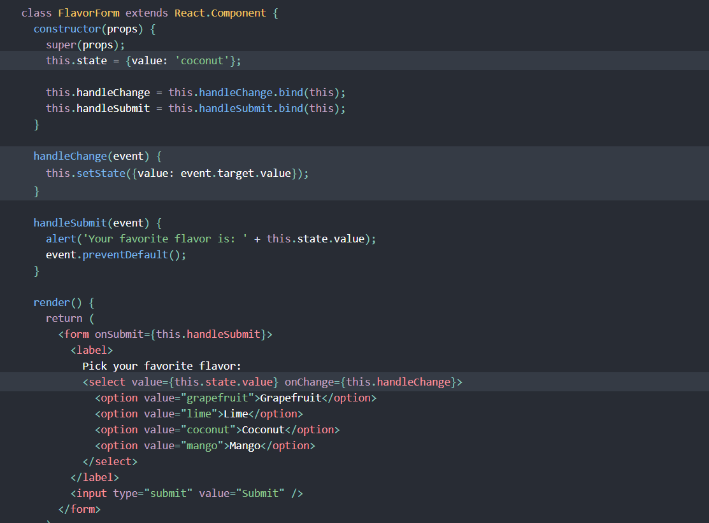

# React Docs - Forms
1. **What is a ‘Controlled Component’?**
**“controlled component”.**: An input form element whose value is controlled by React. We can combine the two;(In HTML, form elements typically maintain their own state and update it based on user input. In React, mutable state is typically kept in the state property of components, and only updated with setState().)We can combine the two by making the React state be the “single source of truth”. Then the React component that renders a form also controls what happens in that form on subsequent user input.
.

2. **Should we wait to store the users responses from the form into state when they submit the form OR should we update the state with their responses as soon as they enter them? Why.**
We Should update the state with their responses as soon as they enter them because the **handleChange** runs on every keystroke to update the React state, the displayed value will update as the user types.
.

3. **How do we target what the user is entering if we have an event handler on an input field?**
In HTML, (select> creates a drop-down list. React, instead of using this selected attribute, uses a value attribute on the root select tag. This is more convenient in a controlled component because you only need to update it in one place.

# The Conditional (Ternary) Operator Explained
1. **Why would we use a ternary operator?**
It Shorten your if statements into one line of code with the conditional (Ternary) operator.
.

2. **Rewrite the following statement using a ternary statement:
  if(x===y){
 console.log(true);
  } else {
 console.log(false);
  }**

  x===y ? console.log(true) : console.log(false);
  .
  ## Ex:

  

  ## Things I want to know more about
