# Chart.js API
#### EASILY CREATE STUNNING ANIMATED CHARTS WITH CHART.JS:
###### Charts are far better for displaying data visually than tables and have the added benefit that no one is ever going to press-gang them into use as a layout tool. They’re easier to look at and convey data quickly, but they’re not always easy to create.
###### A great way to get started with charts is with **Chart.js**, a JavaScript plugin that uses HTML5’s canvas element to draw the graph onto the page. It’s a well documented plugin that makes using all kinds of bar charts, line charts, pie charts and more, incredibly easy.

###  Setting up
The first thing we need to do is download Chart.js. Copy the Chart.min.js out of the unzipped folder and into the directory you’ll be working in. Then create a new html page and import the script:
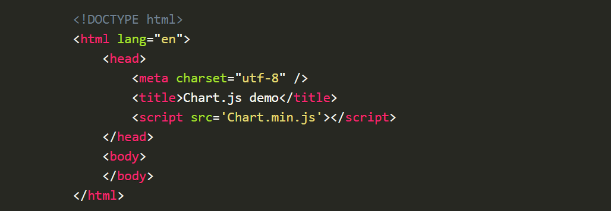

### 1. Drawing a line chart:
To draw a line chart, the first thing we need to do is create a canvas element in our HTML in which Chart.js can draw our chart. So add this to the body of our HTML page:
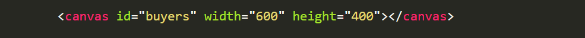
Next, we need to write a script that will retrieve the context of the canvas, so add this to the foot of your body element:
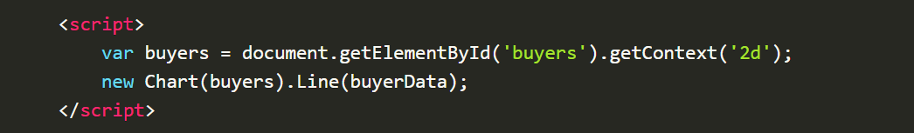
Inside the same script tags we need to create our data, in this instance it’s an object that contains labels for the base of our chart and datasets to describe the values on the chart.
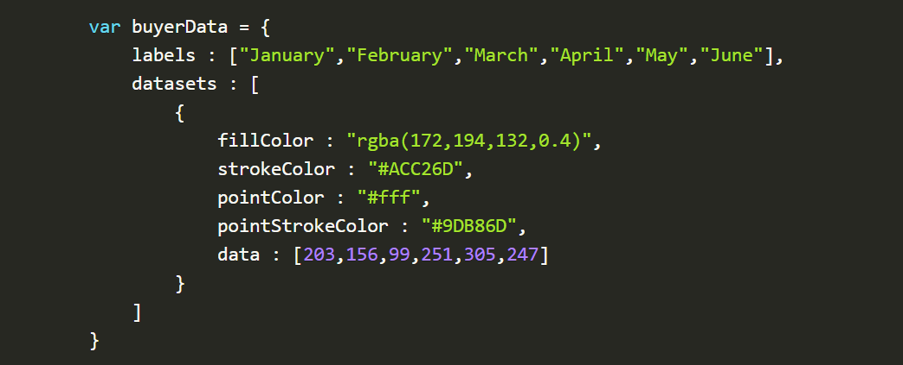

### 2. Drawing a pie chart:
First, we need the canvas element: 
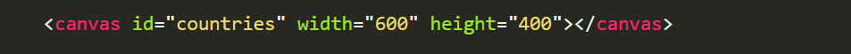
Next, we need to get the context and to instantiate the chart:
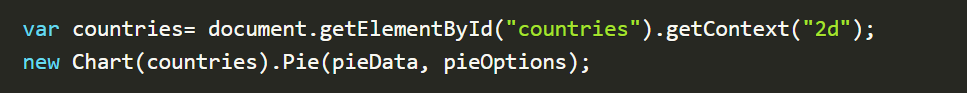
You’ll notice that this time, we are going to supply some options to the chart.

Next we need to create the data. This data is a little different to the line chart because the pie chart is simpler, we just need to supply a value and a color for each section:
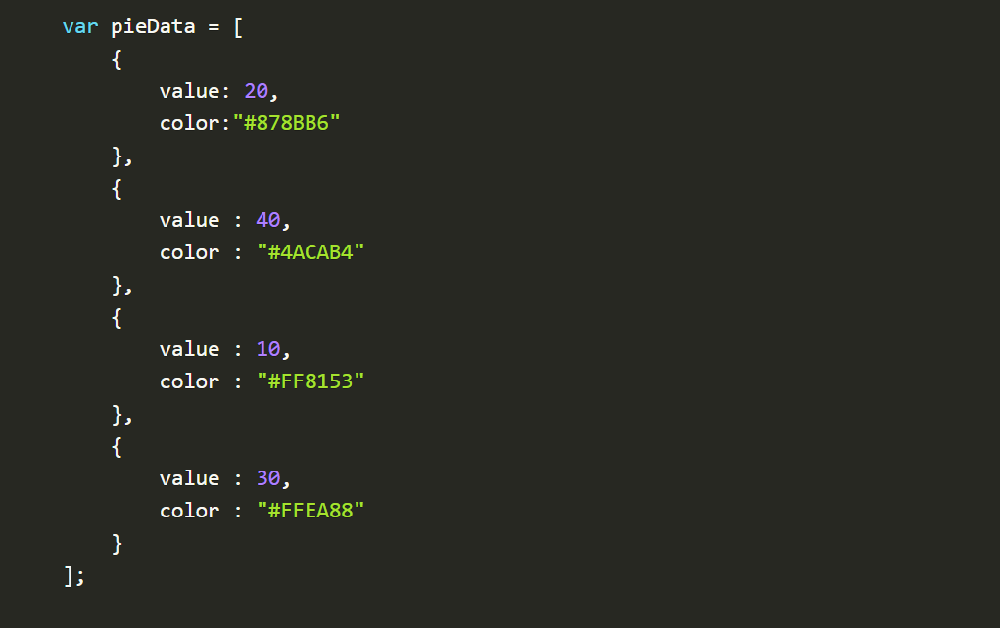
Now, immediately after the pieData we’ll add our options:
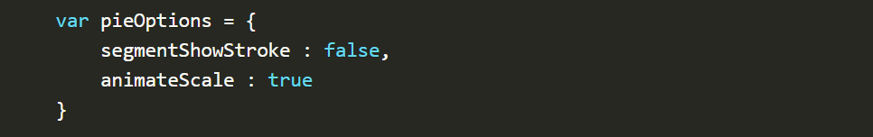
These options do two things, first they remove the stroke from the segments, and then they animate the scale of the pie so that it zooms out from nothing.

### 3. Drawing a bar chart:
Finally, let’s add  a bar chart to our page. Happily the syntax for the bar chart is very similar to the line chart we’ve already added. First, we add the canvas element:
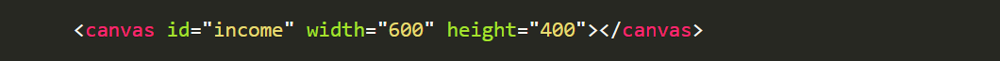
Next, we retrieve the element and create the graph:
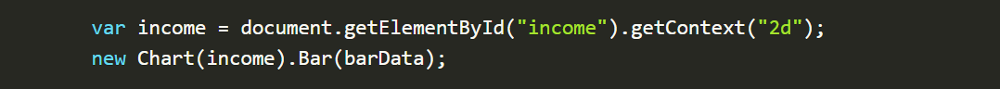
And finally, we add in the bar chart’s data:
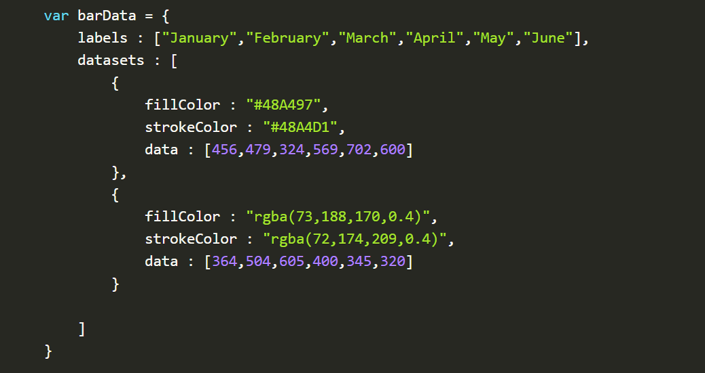
As you can see, the data is largely the same, except this time we’ve chosen to use RGBA to specify our colors which allows us to add transparency.

# Basic usage of canvas
### The (canvas) element:
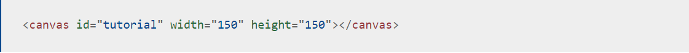
At first sight a (canvas) looks like the (img) element, with the only clear difference being that it doesn't have the src and alt attributes. Indeed, the (canvas) element has only two attributes, width and height. These are both optional and can also be set using DOM properties. When no width and height attributes are specified, the canvas will initially be 300 pixels wide and 150 pixels high. The element can be sized arbitrarily by CSS, but during rendering the image is scaled to fit its layout size: if the CSS sizing doesn't respect the ratio of the initial canvas, it will appear distorted.

The id attribute isn't specific to the (canvas) element but is one of the global HTML attributes which can be applied to any HTML element (like class for instance). It is always a good idea to supply an id because this makes it much easier to identify it in a script.

### Fallback content
The (canvas) element differs from an (img) tag in that, it is easy to define some fallback content, to be displayed in older browsers not supporting it, like versions of Internet Explorer earlier than version 9 or textual browsers. You should always provide fallback content to be displayed by those browsers.

Providing fallback content is very straightforward: just insert the alternate content inside the (canvas) element. Browsers that don't support (canvas) will ignore the container and render the fallback content inside it. Browsers that do support (canvas) will ignore the content inside the container, and just render the canvas normally.
##### Required (/canvas) tag
As a consequence of the way fallback is provided, unlike the (img) element, the (canvas) element requires the closing tag (/canvas). If this tag is not present, the rest of the document would be considered the fallback content and wouldn't be displayed.

### The rendering context
The (canvas) element creates a fixed-size drawing surface that exposes one or more rendering contexts, which are used to create and manipulate the content shown. In this tutorial, we focus on the 2D rendering context.
The canvas is initially blank. To display something, a script first needs to access the rendering context and draw on it. The (canvas) element has a method called getContext(), used to obtain the rendering context and its drawing functions. getContext() takes one parameter, the type of context. For 2D graphics, such as those covered by this tutorial, you specify "2d" to get a CanvasRenderingContext2D.
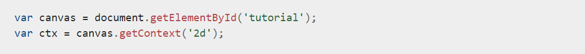

### Checking for support
The fallback content is displayed in browsers which do not support (canvas). Scripts can also check for support programmatically by testing for the presence of the getContext() method.

# Drawing shapes with canvas
 ###### By the end of this article, you will have learned how to draw rectangles, triangles, lines, arcs and curves, providing familiarity with some of the basic shapes. Working with paths is essential when drawing objects onto the canvas and we will see how that can be done.

### The grid
Before we can start drawing, we need to talk about the canvas grid or **coordinate space**. 
Normally 1 unit in the grid corresponds to 1 pixel on the canvas. The origin of this grid is positioned in the top left corner at coordinate (0,0). All elements are placed relative to this origin. So the position of the top left corner of the blue square becomes x pixels from the left and y pixels from the top, at coordinate (x,y).
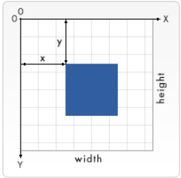

### Drawing rectangles
###### Unlike SVG, <canvas> only supports two primitive shapes: rectangles and paths (lists of points connected by lines). All other shapes must be created by combining one or more paths. Luckily, we have an assortment of path drawing functions which make it possible to compose very complex shapes. There are three functions that draw rectangles on the canvas:
**1. fillRect(x, y, width, height)
Draws a filled rectangle.**

**2. strokeRect(x, y, width, height)
Draws a rectangular outline.**

**3.clearRect(x, y, width, height)
Clears the specified rectangular area, making it fully transparent.**
Each of these three functions takes the same parameters. x and y specify the position on the canvas (relative to the origin) of the top-left corner of the rectangle. width and height provide the rectangle's size.

### Drawing paths
###### A path is a list of points, connected by segments of lines that can be of different shapes, curved or not, of different width and of different color. A path, or even a subpath, can be closed. To make shapes using paths, we take some extra steps:

**1.First, you create the path.**

**2.Then you use drawing commands to draw into the path.**

**3.Once the path has been created, you can stroke or fill the path to render it.**

Here are the functions used to perform these steps:
**1. beginPath()
Creates a new path. Once created, future drawing commands are directed into the path and used to build the path up.**

**2. Path methods
Methods to set different paths for objects.**

**3. closePath()
Adds a straight line to the path, going to the start of the current sub-path.**

**4.stroke()
Draws the shape by stroking its outline.**

**5. fill()
Draws a solid shape by filling the path's content area.**

###### 1. The first step to create a path is to call the beginPath(). Internally, paths are stored as a list of sub-paths (lines, arcs, etc) which together form a shape. Every time this method is called, the list is reset and we can start drawing new shapes.
 ###### 2.The second step is calling the methods that actually specify the paths to be drawn.
 ###### 3.The third, and an optional step, is to call closePath(). This method tries to close the shape by drawing a straight line from the current point to the start. If the shape has already been closed or there's only one point in the list, this function does nothing.

##### Moving the pen
One very useful function, which doesn't actually draw anything but becomes part of the path list described above, is the moveTo() function. You can probably best think of this as lifting a pen or pencil from one spot on a piece of paper and placing it on the next.
**moveTo(x, y)
Moves the pen to the coordinates specified by x and y.**

##### Lines
For drawing straight lines, use the lineTo() method.
**lineTo(x, y)
Draws a line from the current drawing position to the position specified by x and y.**
This method takes two arguments, x and y, which are the coordinates of the line's end point. The starting point is dependent on previously drawn paths, where the end point of the previous path is the starting point for the following, etc. The starting point can also be changed by using the moveTo() method.
