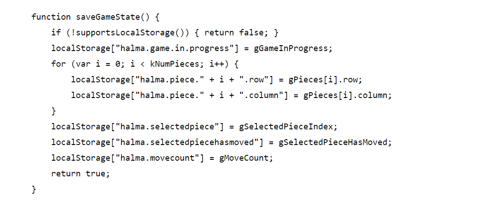
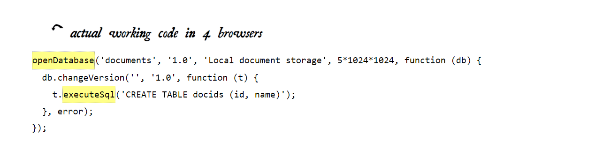

# Local Storage
## “The Past, Present, and Future of Local Storage for Web Applications”

###### Persistent local storage is one of the areas where native client applications have held an advantage over web applications. For native applications, the operating system typically provides an abstraction layer for storing and retrieving application-specific data like preferences or runtime state. These values may be stored in the registry, INI files, XML files, or some other place according to platform convention. Historically, web applications have had none of these luxuries. Cookies were invented early in the web’s history, and indeed they can be used for persistent local storage of small amounts of data. But they have three potentially dealbreaking downsides:
+ Cookies are included with every HTTP request, thereby slowing down your web application by needlessly transmitting the same data over and over
+ Cookies are included with every HTTP request, thereby sending data unencrypted over the internet (unless your entire web application is served over SSL).
+ Cookies are limited to about 4 KB of data — enough to slow down your application , but not enough to be terribly useful.
###### What we really want is:
+ a lot of storage space
+ on the client
+ that persists beyond a page refresh
+ and isn’t transmitted to the server.

## A BRIEF HISTORY OF LOCAL STORAGE HACKS BEFORE HTML5:
In the beginning, there was only Internet Explorer. To that end, as part of the First **Great Browser Wars**, Microsoft invented a great many things and included them in their browser-to-end-all-browser-wars, Internet Explorer. One of these things was called **DHTML Behaviors**, and one of these behaviors was called **userData**. userData allows web pages to store up to 64 KB of data per domain, in a hierarchical XML-based structure. IE does not present any form of permissions dialog, and there is no allowance for increasing the amount of storage available. 
+ In 2002, Adobe introduced a feature in Flash 6 that gained the unfortunate and misleading name of **“Flash cookies.”** Briefly, it allows Flash objects to store up to 100 KB of data per domain. Brad Neuberg developed an early prototype of a Flash-to-JavaScript bridge called AMASS (AJAX Massive Storage System), but it was limited by some of Flash’s design quirks.
.
+ By 2006, with the advent of ExternalInterface in Flash 8, accessing LSOs from JavaScript became an order of magnitude easier and faster. Brad rewrote AMASS and integrated it into the popular Dojo Toolkit under the moniker dojox.storage. Flash gives each domain 100 KB of storage “for free.” Beyond that, it prompts the user for each order of magnitude increase in data storage (1 Mb, 10 Mb, and so on).
.
 + In 2007, Google launched Gears, an open source browser plugin aimed at providing additional capabilities in browsers. Gears provides an API to an embedded SQL database based on SQLite. After obtaining permission from the user once, Gears can store unlimited amounts of data per domain in SQL database tables.
 .
 + By 2009, dojox.storage could auto-detect (and provide a unified interface on top of) Adobe Flash, Gears, Adobe AIR, and an early prototype of HTML5 storage that was only implemented in older versions of Firefox.

 **So this is the problem that HTML5 set out to solve: to provide a standardized API, implemented natively and consistently in multiple browsers, without having to rely on third-party plugins.**

## INTRODUCING HTML5 STORAGE:
###### What I will refer to as “HTML5 Storage” is a specification named Web Storage. Certain browser vendors also refer to it as “Local Storage” or “DOM Storage.” 
**So what is HTML5 Storage?**
it’s a way for web pages to store named key/value pairs locally, within the client web browser. Like cookies, this data persists even after you navigate away from the web site, close your browser tab, exit your browser, or what have you. Unlike cookies, this data is never transmitted to the remote web server (unless you go out of your way to send it manually). Unlike all previous attempts at providing persistent local storage, it is implemented natively in web browsers, so it is available even when third-party browser plugins are not.

**Which browsers? Well, the latest version of pretty much every browser supports HTML5 Storage… even Internet Explorer!**

From your JavaScript code, you’ll access HTML5 Storage through the localStorage object on the global window object. Before you can use it, you should detect whether the browser supports it.

## USING HTML5 STORAGE:
###### HTML5 Storage is based on named key/value pairs. You store data based on a named key, then you can retrieve that data with the same key. The named key is a string. The data can be any type supported by JavaScript, including strings, Booleans, integers, or floats. However, the data is actually stored as a string. If you are storing and retrieving anything other than strings, you will need to use functions like parseInt() or parseFloat() to coerce your retrieved data into the expected JavaScript datatype.
Calling **setItem()** with a named key that already exists will silently overwrite the previous value. Calling **getItem()** with a non-existent key will return **null** rather than throw an exception.

Like other JavaScript objects, you can treat the localStorage object as an associative array. Instead of using the getItem() and setItem() methods, you can simply use square brackets.

There are also methods for removing the value for a given named key, and clearing the entire storage area (that is, deleting all the keys and values at once). **removeItem()**.
Calling removeItem() with a non-existent key will do nothing.

Finally, there is a property to get the total number of values in the storage area, and to iterate through all of the keys by index (to get the name of each key). If you call key() with an index that is not between 0–(length-1), the function will return null.

## TRACKING CHANGES TO THE HTML5 STORAGE AREA:
###### If you want to keep track programmatically of when the storage area changes, you can trap the storage event. The storage event is fired on the window object whenever setItem(), removeItem(), or clear() is called and actually changes something. For example, if you set an item to its existing value or call clear() when there are no named keys, the storage event will not fire, because nothing actually changed in the storage area.

The storage event is supported everywhere the localStorage object is supported, which includes Internet Explorer 8. Therefore, to hook the storage event, you’ll need to check which event mechanism the browser supports. Trapping the storage event works the same as every other event you’ve ever trapped. If you prefer to use jQuery or some other JavaScript library to register your event handlers, you can do that with the storage event, too. The **handle_storage** callback function will be called with a **StorageEvent object**, except in Internet Explorer where the event object is stored in **window** event.
The storage event is not cancelable. From within the handle_storage callback function, there is no way to stop the change from occurring.

## LIMITATIONS IN CURRENT BROWSERS:
**“5 megabytes”** is how much storage space each origin gets by default. This is surprisingly consistent across browsers, although it is phrased as no more than a suggestion in the HTML5 Storage specification. One thing to keep in mind is that you’re storing strings, not data in its original format. If you’re storing a lot of integers or floats, the difference in representation can really add up. Each digit in that float is being stored as a character, not in the usual representation of a floating point number.

**“QUOTA_EXCEEDED_ERR”** is the exception that will get thrown if you exceed your storage quota of 5 megabytes. **“No”** is the answer to the next obvious question, “Can I ask the user for more storage space?” At time of writing (February 2011), no browser supports any mechanism for web developers to request more storage space. Some browsers (like Opera) allow the user to control each site’s storage quota, but it is purely a user-initiated action, not something that you as a web developer can build into your web application.

## HTML5 STORAGE IN ACTION:
###### With HTML5 Storage, we can save the progress locally, within the browser itself. Make a few moves, then close the browser tab, then re-open it. If your browser supports HTML5 Storage, the demonstration page should magically remember your exact position within the game, for example, including the number of moves you’ve made, the position of each of the pieces on the board, and even whether a particular piece is selected.
How does it work? Every time a change occurs within the game, we call this function:

As you can see, it uses the localStorage object to save whether there is a game in progress (gGameInProgress, a Boolean). If so, it iterates through the pieces (gPieces, a JavaScript Array) and saves the row and column number of each piece. Then it saves some additional game state, including which piece is selected (gSelectedPieceIndex, an integer), whether the piece is in the middle of a potentially long series of hops (gSelectedPieceHasMoved, a Boolean), and the total number of moves made so far (gMoveCount, an integer).

On page load, instead of automatically calling a newGame() function that would reset these variables to hard-coded values, we call a resumeGame() function instead. Using HTML5 Storage, the resumeGame() function checks whether a state about a game-in-progress is stored locally. If so, it restores those values using the localStorage object.

## BEYOND NAMED KEY-VALUE PAIRS: COMPETING VISIONS
###### The present condition of HTML5 Storage is surprisingly rosy. A new API has been standardized and implemented across all major browsers, platforms, and devices. There are competing visions.

+ One vision is an acronym that you probably know already: SQL. In 2007, Google launched Gears, an open source cross-browser plugin which included an embedded database based on SQLite. This early prototype later influenced the creation of the Web SQL Database specification. Web SQL Database (formerly known as “WebDB”) provides a thin wrapper around a SQL database, allowing you to do things like this from JavaScript:

  As you can see, most of the action resides in the string you pass to the executeSql method. This string can be any supported SQL statement, including SELECT, UPDATE, INSERT, and DELETE statements. It’s just like backend database programming, except you’re doing it from JavaScript! 
  .

+ I will introduce you to another competing vision for advanced, persistent, local storage for web applications: **the Indexed Database API**, formerly known as **“WebSimpleDB,”** now affectionately known as **“IndexedDB.”** 

The Indexed Database API exposes what’s called an object store. An object store shares many concepts with a SQL database. There are “databases” with “records,” and each record has a set number of “fields.” Each field has a specific datatype, which is defined when the database is created. You can select a subset of records, then enumerate them with a “cursor.” Changes to the object store are handled within “transactions.” 

IndexedDB has only been implemented in a beta version of Firefox 4. (By contrast, Mozilla has stated that they will never implement Web SQL Database.) Google has stated that they are considering IndexedDB support for Chromium and Google Chrome. And even Microsoft has said that IndexedDB “is a great solution for the web.”

