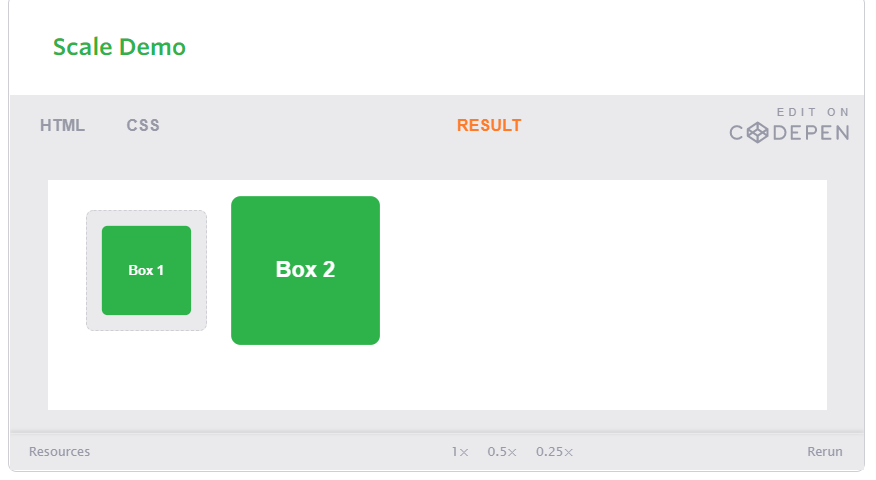

# What Google Learned From Its Quest to Build the Perfect Team
### Our data-saturated age:
It enables us to examine our work habits and office quirks with a scrutiny that our cubicle-bound forebears could only dream of. Today, on corporate campuses and within university laboratories, psychologists, sociologists and statisticians are devoting themselves to studying everything from team composition to email patterns in order to figure out how to make employees into faster, better and more productive versions of themselves.

**THE WORK ISSUE:**
01. How to Build a Perfect Team
02. The War on Meetings
03. The Case for Blind Hiring
04. Failure to Lunch
05. The 'Good Jobs' Gamble
06. Rethinking the Work-Life Equation
07. The Rise of White-Collar Automation
08. The Post-Cubicle Office
09. The New Dream Jobs

###### Yet many of today’s most valuable firms have come to realize that analyzing and improving individual workers ­— a practice known as ‘‘employee performance optimization’’ — isn’t enough. As commerce becomes increasingly global and complex, the bulk of modern work is more and more team-based. Studies show that groups tend to innovate faster, see mistakes more quickly and find better solutions to problems. Studies also show that people working in teams tend to achieve better results and report higher job satisfaction. If a company wants to outstrip its competitors, it needs to influence not only how people work but also how they *work together*.

**Five years ago, Google — one of the most public proselytizers of how studying workers can transform productivity — became focused on building the perfect team. In the last decade, the tech giant has spent untold millions of dollars measuring nearly every aspect of its employees’ lives. Google’s People Operations department has scrutinized everything from how frequently particular people eat together  to which traits the best managers share.**

**In 2012, the company embarked on an initiative — code-named Project Aristotle — to study hundreds of Google’s teams and figure out why some stumbled while others soared. Dubey, a leader of the project, gathered some of the company’s best statisticians, organizational psychologists, sociologists and engineers.**

### Project Aristotle’s researchers: 
It began by reviewing a half-century of academic studies looking at how teams worked. Based on those studies, the researchers scrutinized the composition of groups inside Google. They drew diagrams showing which teams had overlapping memberships and which groups had exceeded their departments’ goals. They studied how long teams stuck together and if gender balance seemed to have an impact on a team’s success.

No matter how researchers arranged the data, though, it was almost impossible to find patterns — or any evidence that the composition of a team made any difference. 

###### As they struggled to figure out what made a team successful, Rozovsky and her colleagues kept coming across research by psychologists and sociologists that focused on what are known as **‘‘group norms.’’** Norms are the traditions, behavioral standards and unwritten rules that govern how we function when we gather. Norms can be unspoken or openly acknowledged, but their influence is often profound. Team members may behave in certain ways as individuals — they may chafe against authority or prefer working independently — but when they gather, the group’s norms typically override individual proclivities and encourage deference to the team.

After looking at over a hundred groups for more than a year, Project Aristotle researchers concluded that understanding and influencing group norms were the keys to improving Google’s teams. Google’s research had identified dozens of behaviors that seemed important, except that sometimes the norms of one effective team contrasted sharply with those of another equally successful group. The data didn’t offer clear verdicts. In fact, the data sometimes pointed in opposite directions. 

The researchers recruited 699 people, divided them into small groups and gave each a series of assignments that required different kinds of cooperation. What interested the researchers most, however, was that teams that did well on one assignment usually did well on all the others. Conversely, teams that failed at one thing seemed to fail at everything. The researchers eventually concluded that what distinguished the ‘‘good’’ teams from the dysfunctional groups was how teammates treated one another. The right norms, in other words, could raise a group’s collective intelligence, whereas the wrong norms could hobble a team, even if, individually, all the members were exceptionally bright.

As the researchers studied the groups, however, they noticed two behaviors that all the good teams generally shared. **First,** on the good teams, members spoke in roughly the same proportion, a phenomenon the researchers referred to as ‘‘equality in distribution of conversational turn-taking.’’ On some teams, everyone spoke during each task; on others, leadership shifted among teammates from assignment to assignment. But in each case, by the end of the day, everyone had spoken roughly the same amount.

**Second,** the good teams all had high ‘‘average social sensitivity’’ — a fancy way of saying they were skilled at intuiting how others felt based on their tone of voice, their expressions and other nonverbal cues. One of the easiest ways to gauge social sensitivity is to show someone photos of people’s eyes and ask him or her to describe what the people are thinking or feeling — an exam known as the Reading the Mind in the Eyes test.

Within psychology, researchers sometimes colloquially refer to traits like ‘‘conversational turn-taking’’ and ‘‘average social sensitivity’’ as aspects of what’s known as psychological safety — a group culture that the Harvard Business School professor Amy Edmondson defines as a ‘‘shared belief held by members of a team that the team is safe for interpersonal risk-taking.’’ Psychological safety is ‘‘a sense of confidence that the team will not embarrass, reject or punish someone for speaking up,’’

###### For Project Aristotle, research on psychological safety pointed to particular norms that are vital to success. There were other behaviors that seemed important as well — like making sure teams had clear goals and creating a culture of dependability. But Google’s data indicated that psychological safety, more than anything else, was critical to making a team work. However, establishing psychological safety is, by its very nature, somewhat messy and difficult to implement. The kinds of people who work at Google are often the ones who became software engineers because they wanted to avoid talking about feelings in the first place. 

**In late 2014, Rozovsky and her fellow Project Aristotle number-crunchers began sharing their findings with select groups of Google’s 51,000 employees. By then, they had been collecting surveys, conducting interviews and analyzing statistics for almost three years. They hadn’t yet figured out how to make psychological safety easy, but they hoped that publicizing their research within Google would prompt employees to come up with some ideas of their own.**

###### What Project Aristotle has taught people within Google is that no one wants to put on a ‘‘work face’’ when they get to the office. No one wants to leave part of their personality and inner life at home. But to be fully present at work, to feel ‘‘psychologically safe,’’ we must know that we can be free enough, sometimes, to share the things that scare us without fear of recriminations.

### The technology industry
It is not just one of the fastest growing parts of our economy; it is also increasingly the world’s dominant commercial culture.

The paradox, of course, is that Google’s intense data collection and number crunching have led it to the same conclusions that good managers have always known. In the best teams, members listen to one another and show sensitivity to feelings and needs. Google, in its race to build the perfect team, has perhaps unintentionally demonstrated the usefulness of imperfection and done what Silicon Valley does best: figure out how to create psychological safety faster, better and in more productive ways.

Project Aristotle is a reminder that when companies try to optimize everything, it’s sometimes easy to forget that success is often built on experiences — like emotional interactions and complicated conversations and discussions of who we want to be and how our teammates make us feel — that can’t really be optimized.

# CSS Transforms
###### With CSS3 came new ways to position and alter elements. Now general layout techniques can be revisited with alternative ways to size, position, and change elements. All of these new techniques are made possible by the transform property. The transform property comes in two different settings, two-dimensional and three-dimensional. Each of these come with their own individual properties and values.

### Transform Syntax
The actual syntax for the transform property is quite simple, including the transform property followed by the value. The value specifies the transform type followed by a specific amount inside parentheses.

Notice how the transform property includes multiple vendor prefixes to gain the best support across all browsers. The un-prefixed declaration comes last to overwrite the prefixed versions, should a browser fully support the transform property.

### 2D Transforms
###### Elements may be distorted, or transformed, on both a two-dimensional plane or a three-dimensional plane. Two-dimensional transforms work on the x and y axes, known as horizontal and vertical axes. Three-dimensional transforms work on both the x and y axes, as well as the z axis. These three-dimensional transforms help define not only the length and width of an element, but also the depth. We’ll start by discussing how to transform elements on a two-dimensional plane, and then work our way into three-dimensional transforms.

#### 2D Rotate
The transform property accepts a handful of different values. The rotate value provides the ability to rotate an element from 0 to 360 degrees. Using a positive value will rotate an element clockwise, and using a negative value will rotate the element counterclockwise. The default point of rotation is the center of the element, 50% 50%, both horizontally and vertically. 

#### 2D Scale
Using the scale value within the transform property allows you to change the appeared size of an element. The default scale value is 1, therefore any value between .99 and .01 makes an element appear smaller while any value greater than or equal to 1.01 makes an element appear larger.

It is possible to scale only the height or width of an element using the scaleX and scaleY values. The scaleX value will scale the width of an element while the scaleY value will scale the height of an element. To scale both the height and width of an element but at different sizes, the x and y axis values may be set simultaneously. To do so, use the scale transform declaring the x axis value first, followed by a comma, and then the y axis value.

#### 2D Translate
The translate value works a bit like that of relative positioning, pushing and pulling an element in different directions without interrupting the normal flow of the document. Using the translateX value will change the position of an element on the horizontal axis while using the translateY value will change the position of an element on the vertical axis.

As with the scale value, to set both the x and y axis values at once, use the translate value and declare the x axis value first, followed by a comma, and then the y axis value.
Positive values will push an element down and to the right of its default position while negative values will pull an element up and to the left of its default position.

#### 2D Skew
The last transform value in the group, skew, is used to distort elements on the horizontal axis, vertical axis, or both. The syntax is very similar to that of the scale and translate values. Using the skewX value distorts an element on the horizontal axis while the skewY value distorts an element on the vertical axis. To distort an element on both axes the skew value is used, declaring the x axis value first, followed by a comma, and then the y axis value.%p

The distance calculation of the skew value is measured in units of degrees. Length measurements, such as pixels or percentages, do not apply here.

### Combining Transforms
It is common for multiple transforms to be used at once, rotating and scaling the size of an element at the same time for example. In this event multiple transforms can be combined together. To combine transforms, list the transform values within the transform property one after the other without the use of commas.

Using multiple transform declarations will not work, as each declaration will overwrite the one above it. The behavior in that case would be the same as if you were to set the height of an element numerous times.

### Transform Origin
As previously mentioned, the default transform origin is the dead center of an element, both 50% horizontally and 50% vertically. To change this default origin position the transform-origin property may be used.

The transform-origin property can accept one or two values. When only one value is specified, that value is used for both the horizontal and vertical axes. If two values are specified, the first is used for the horizontal axis and the second is used for the vertical axis.

Individually the values are treated like that of a background image position, using either a length or keyword value. That said, 0 0 is the same value as top left, and 100% 100% is the same value as bottom right. More specific values can also be set, for example 20px 50px would set the origin to 20 pixels across and 50 pixels down the element.

### Perspective
In order for three-dimensional transforms to work the elements need a perspective from which to transform. The perspective for each element can be thought of as a vanishing point, similar to that which can be seen in three-dimensional drawings.

The perspective of an element can be set in two different ways. One way includes using the perspective value within the transform property on individual elements, while the other includes using the perspective property on the parent element residing over child elements being transformed.

Using the perspective value within the transform property works great for transforming one element from a single, unique perspective. When you want to transform a group of elements all with the same perspective, or vanishing point, apply the perspective property to their parent element.

#### Perspective Depth Value
The perspective value can be set as none or a length measurement. The none value turns off any perspective, while the length value will set the depth of the perspective. The higher the value, the further away the perspective appears, thus creating a fairly low intensity perspective and a small three-dimensional change. The lower the value the closer the perspective appears, thus creating a high intensity perspective and a large three-dimensional change.

#### Perspective Origin
As with setting a transform-origin you can also set a perspective-origin. The same values used for the transform-origin property may also be used with the perspective-origin property, and maintain the same relationship to the element. The large difference between the two falls where the origin of a transform determines the coordinates used to calculate the change of a transform, while the origin of a perspective identifies the coordinates of the vanishing point of a transform.
